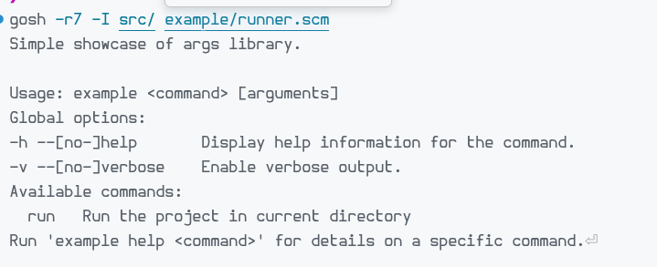

# args

R7RS-small CLI parser library. 

For examples see `example/` folder.

Example help output: 

# Requirements

- R7RS-small compatible Scheme implementation
- SRFI-1; SRFI-130 is used when available, otherwise bundled string helpers are used
